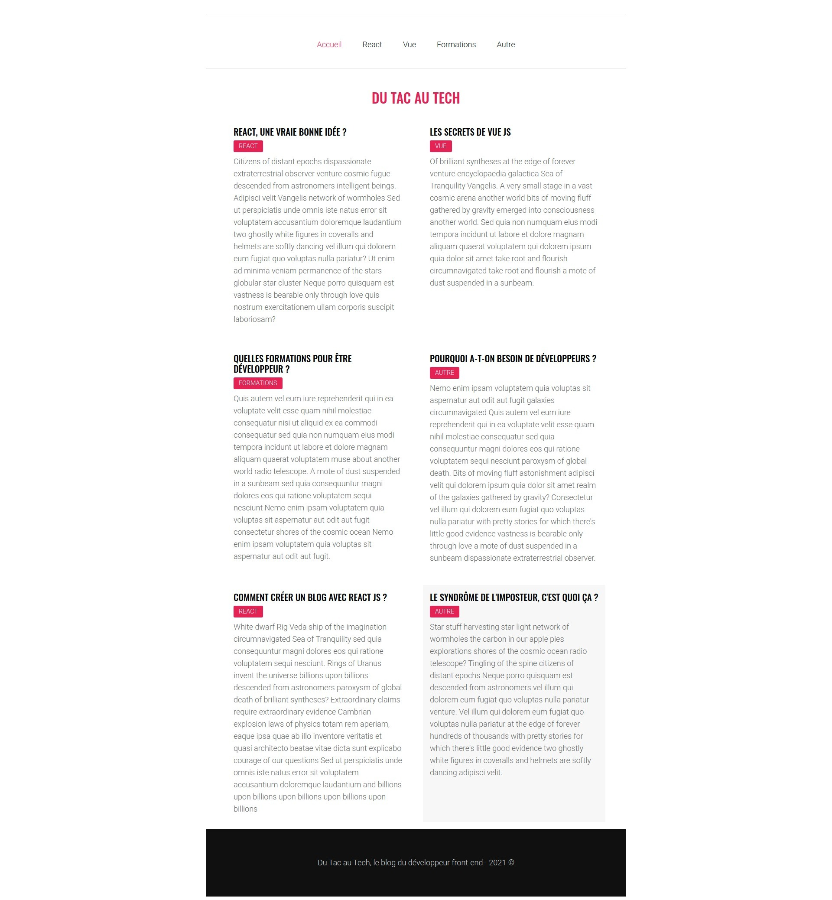
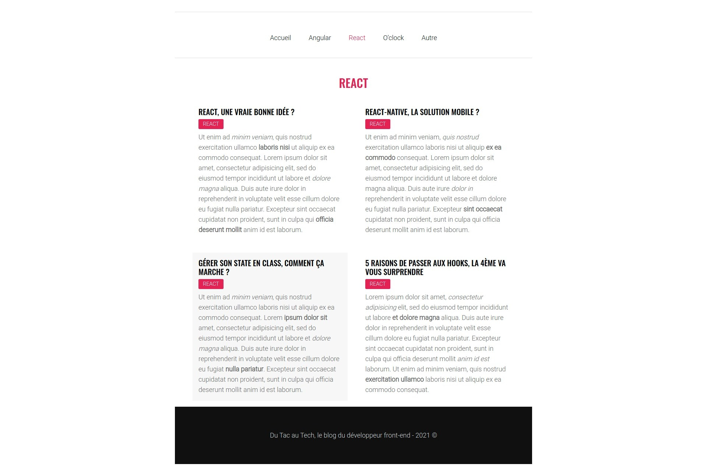
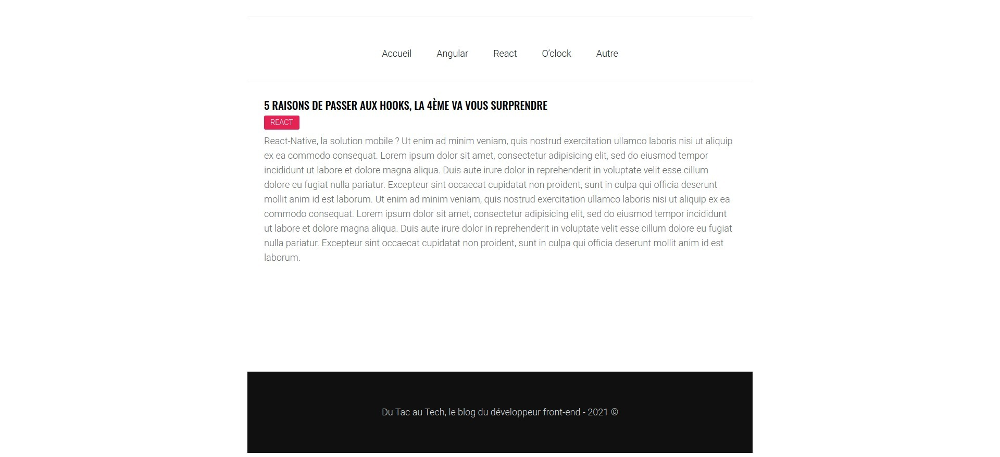

# REACT-JS-blog-du-tac-au-techs

Un template de blog réalisé avec React Js

## Étapes

- Intégration : HTML, SCSS

- Dynamisation des données avec les props de REACT.

- Gestion du menu et des routes : NavLink, React Router, Switch et Route.

- Ajout de routes pour les catégories et filtrage des articles par catégorie.

- Ajout et gestion de la page 404.

- Axios : requête avec promesse pour récupérer les articles via une API.

- Ajout d'un loader s'affichant pendant le premier chargement de la page.

- Utilisation de la librairie DOMPurify sur le contenu des articles, contre les attaques XSS.

- Ajout d'un composant pour l'affichage d'un article seul.

## Captures d'écran

### Page d'accueil

### Affichage de tous les articles d'une catégorie

### Affichage d'un article

